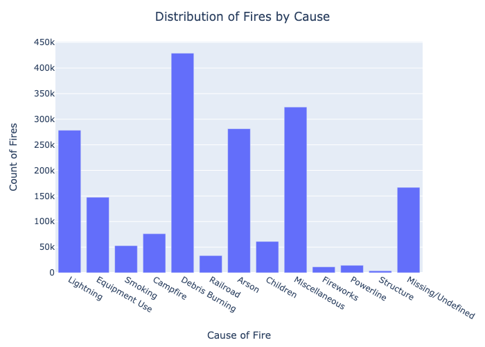
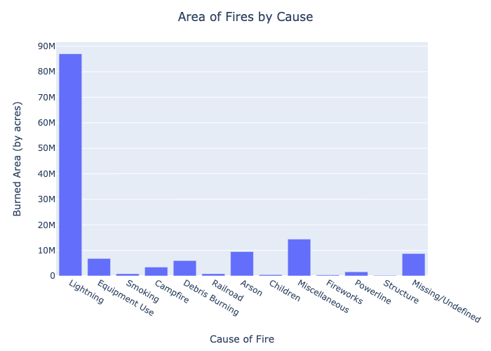

# Mapping and predicting causes of fires in the USA
**By: Dan Ovadia** \
Date: June 8, 2020
# Read Me
This project is intended to explore a large dataset that has been provided by FPA-FOD for the last 5 years. 
There are 1.88 million fires recorded in the United States from 1992-2017 and we will be exploring the causes, and where these fires mostly happen.
----
## Problem Statement
Predicting or preparing for wildfires has always been challenge. Many catastrophes and natural disasters impact society in many different ways, but the shear speed and unpredictability of how wild fires spread and behave still impacts societies today.

In the last five years federal agencies have taken it upon themselves to aggregate and examine fire databases to cummulate an archive of fires, fire causes, and fire sizes to better understand the impacts that fires have had on society as a whole. This data was first made public in 2017, and provides many avenues for investigating and assessing fire risk in the United States. 

Given recent increases in wild fire incidents and fire severity in California and the Pacific North West, catastrophe insurance companies and risk modeling companies have begun to reassess their methodology for pricing fire risk. Since insurance rates and regional governments tend to drive regulation and fire protection methods, assessing the data available is the first step toward building a more resilient society towards wild fire risks. 

## Objective
The intent of this project is to explore the data and to assess the cause of a fire based on date, location, owner code of the land, and reporting agency. These are first steps toward exploring fire risk in the United States and to assess vulnerability of fire hazard in various counties.

## Data
Using data from the US Department of Agriculture, specifically referencing the Spatial wildfire occurrence data for the United States, 1992-2015 (FPA_FOD_20170508) (4th Edition).

This data publication contains a spatial database of wildfires that occurred in the United States from 1992 to 2015. The following core data elements were required for records to be included in this data publication: discovery date, final fire size, and a point location at least as precise as Public Land Survey System (PLSS) section (1-square mile grid). The data were transformed to conform, when possible, to the data standards of the National Wildfire Coordinating Group (NWCG). Basic error-checking was performed and redundant records were identified and removed, to the degree possible. The resulting product, referred to as the Fire Program Analysis fire-occurrence database (FPA FOD), includes 1.88 million geo-referenced wildfire records, representing a total of 140 million acres burned during the 24-year period. [Source: United States Department of Agriculture Forest Service](https://www.fs.usda.gov/rds/archive/catalog/RDS-2013-0009.4)

### Causes 
The data provide 13 statistical causes ranging from natural causes to malicious causes. In the analysis in 

| STAT_CAUSE_CODE | STAT_CAUSE_DESCR |
| ----- | ----------- |
| 1 | Lightning |
| 2 | Equipment Use |
| 3 | Smoking |
| 4 | Campfire |
| 5 | Debris Burning |
| 6 | Railroad |
| 7 | Arson |
| 8 | Children |
| 9 | Miscellaneous |
| 10 | Fireworks |
| 11 | Powerline |
| 12 | Structure |
| 13 | Missing/Undefined |

### Fire Sizes
| Value | Description |
| :---: | :---: |
|   A   | Greater than 0 but less than or equal to 0.25 Acres |
|   B   | 0.26 to 9.9 Acres |
|   C   | 10.0 to 99.9 Acres |
|   D   | 100 to 299 Acres |
|   E   | 300 to 999 Acres |
|   F   | 1000 to 4999 Acres |
|   G   | 5000 to 9999 Acres |
|   H   | 10000 to 49999 Acres |
|   I   | 50000 to 99999 Acres |
|   J   | 100000 to 499999 Acres |
|   K   | 500000 to 999999 Acres |
|   L   | 1000000 + Acres |

## Cleaning
The data do not provide a lot of contextual details into each fire. FIPS codes were missing for a third of the data. In order to thoroughly map out the data by county and assess risk by county, cleaning the FIPS codes by county was essential. This was done by downloading polygons of US counties and checking which county each point of fire ignition belongs to.

## Exploratory Data Analysis
### Section 1 - Fire Causes

   
   
   
   

### EDA
### Mapping
### Modeling

## Section 2 - Mapping large fires in the continuous United States

## EDA

## Mapping

## Modeling

## Conclusion

## Next Steps
